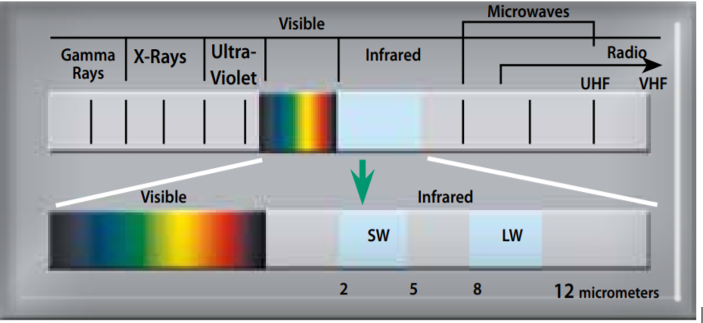
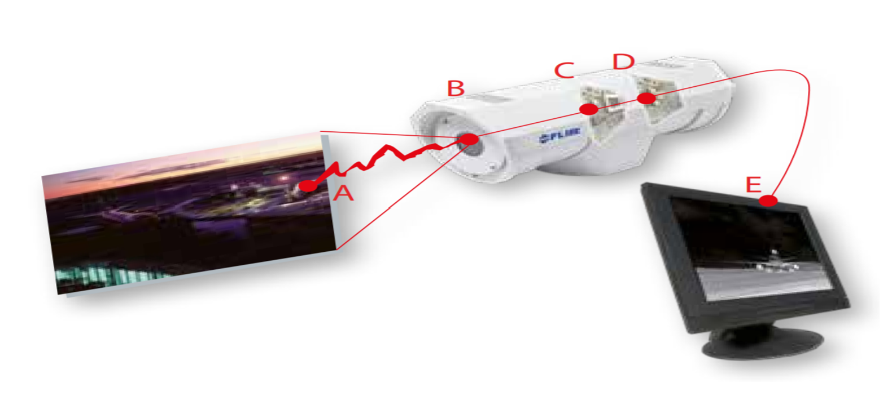
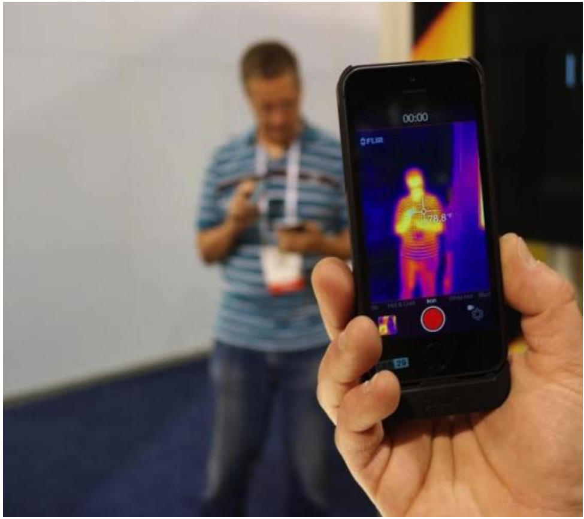
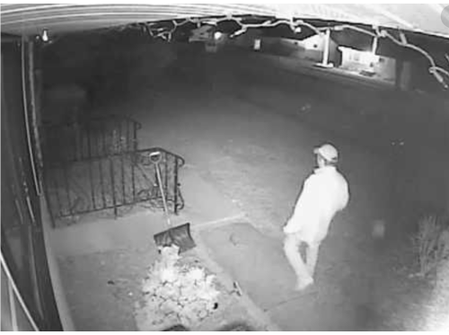
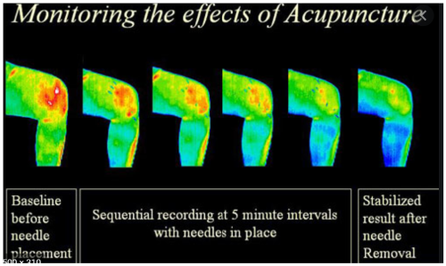
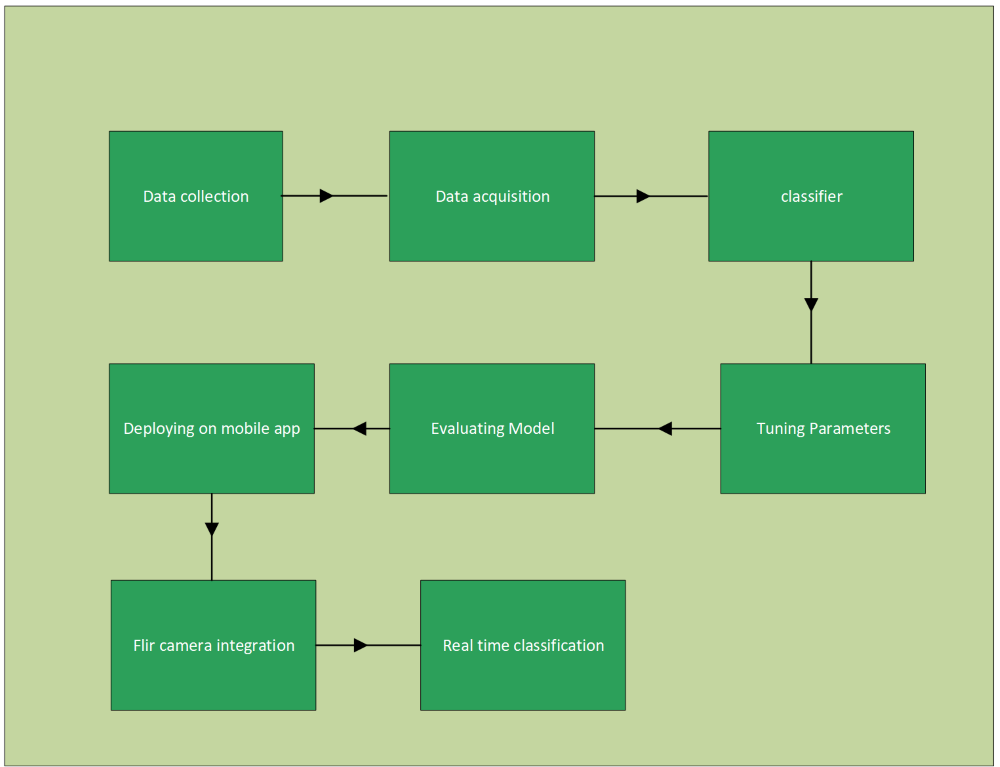
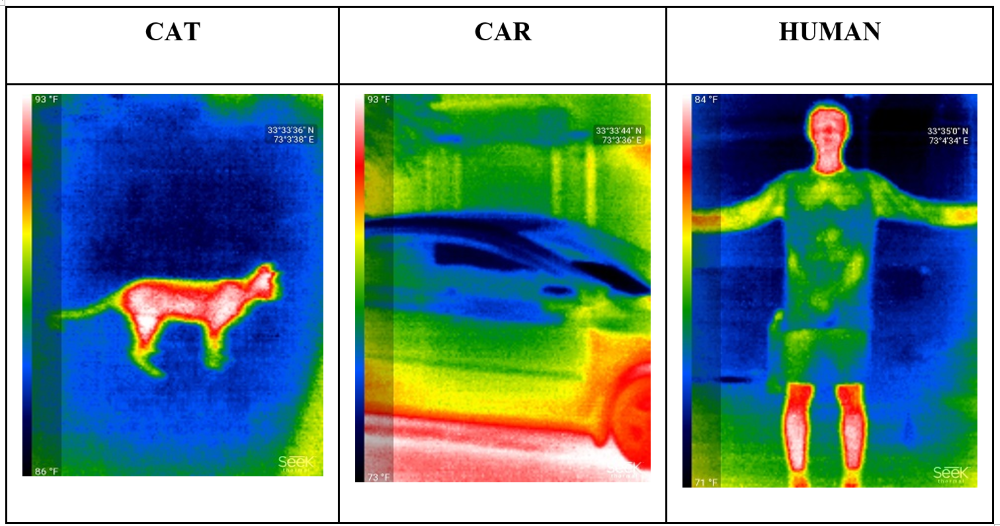
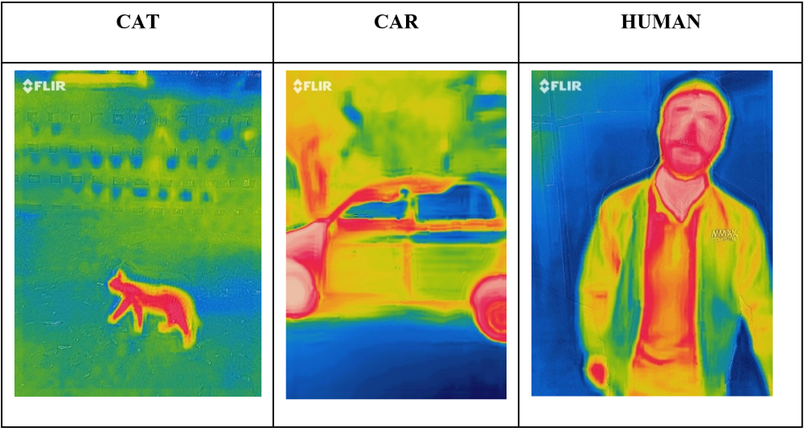
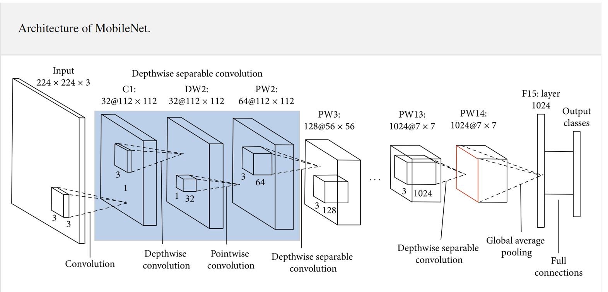
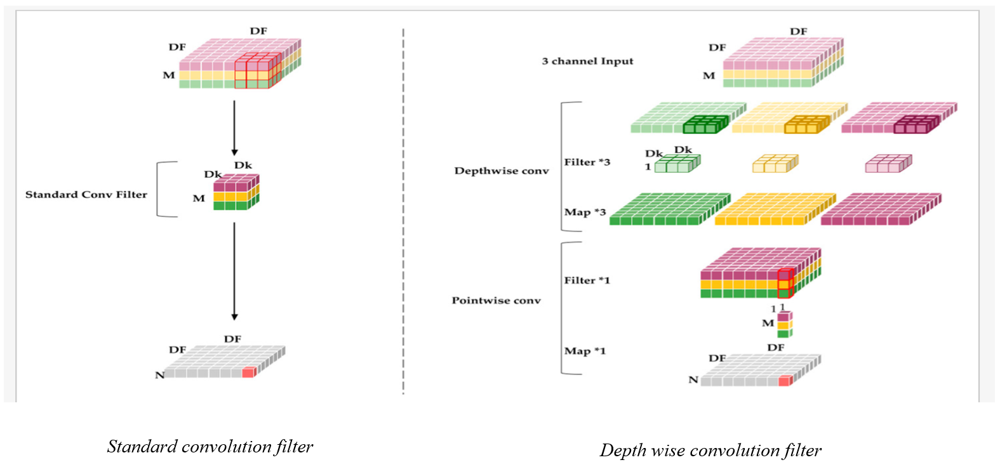

# ABSTRACT
Safety and security has become a concern on every level whether it is on individual level or group of individuals. To visualize and remain conscious about the surroundings in order to know what’s happening has become crucial and essential especially where visual sight is unable to detect the objects like in darker areas. Therefore, we need to develop the mobile app which is capable to detect the surrounding environment in a thermal mode and let the user know in real time about the entities present in his/her surroundings. The hardware to be used is the thermal mobile camera attached with the android phone which will take the input feed in real time and after processing the data, it will display the required results accordingly. The idea here is to train deep learning model first and then run its inference on mobile app because due to this inference the model is capable enough to run on low end powered devices. For model to run on low end powered devices MobileNet architecture is used due to its lightweight and fast neural architecture which reduce the number of parameters drastically. The model uses depthwise separable convolution approach to reduce and optimize the model. The depthwise separable convolution is made up of two layers, firstly it uses depthwise convolution in which single filter is applied to each input channel and then when it comes to pointwise convolution it uses 1 x 1 convolution, after which all the layers are combined to give the output result. The resulted optimized file upon deployment in android will be used to classify the objects without any need of wireless connectivity and reducing the latency. The dataset collected was on three different categories including human, cat and car using the Flir thermal camera and Seek thermal camera. Supervised learning model was trained with using seek thermal camera and tested with images which were taken by Flir camera and the testing accuracy was 90 percent on them.

# Table of Contents
	
1.1	Introduction	

1.2	Motivation	

1.3	Scope	

1.4	Structure	

2.1	Thermal Imaging Camera	

2.2	How Does Thermal Camera Works	

2.3	How Its Different Than Night Vision	

2.4	Applications of Thermal Imaging	

3.1	System level Diagram 

3.2	Software	

3.2.1	Knowledge Base 

3.3	Data Collection	

3.4 Mobilenet Architecture 

3.5	Flow Diagram 

3.6	Software Tools 
	
3.6.1	Tenosrflow Lite Framework 
	
3.6.2	Android Studio 
	
3.6.3	Flir SDK 
	
3.6.4	Mobile App Screen 

3.7	Hardware	

3.8 Seek Thermal and Flir Specs 

4.1 Android App 

5.1 Performance and Tuning Parameters 

5.2	Accuracy and Evaluation	

6.1	Conclusion	

6.2	Future Prospects	

References 

# Chapter 1: Introduction 

# 1.1	Introduction
Human eyes can only be able to detect that can only be able to detect electromagnetic radiations in the range of visible spectrum while other ranges such as infrared are not visible by our eyes.
The discovery of the infrared goes back in 1800 by Sir Frederick William Herschel. To see thermal difference between various colors of light, he managed to get sunlight passed through prism glass which created spectrum and consequently observed the temperature of each color. While noticing the temperatures of the colors there was increase in temperature from violet to red.
Now having the temperature pattern across different colors, he wanted to extend his research beyond the colors especially red color. He concluded that the temperature was higher in this region than the region before.
The range of infrared radiation is between microwave and visible part of the spectrum. The infrared radiation originates due to heat or thermal radiation. If the temperature of any object is 0 Kelvin or -273.15 Celsius, it will emit radiation in the range of infrared. 
 

Visualizing diminished and faded objects has always been a hurdle in human day to day life. It has always been desired that clear and unambiguous things can be seen even if it is dark and in faded light. It’s really important to be aware of surrounding so that one is able to know what’s happening nearby. Therefore, that said, anyone can be able to continue to resume the activities he/she are doing if he/she exactly classifies what objects are there in front of him/her.

# 1.2   Motivation
It’s natural and easy to do nearly anything in the daylight or if there is sufficient light such that our human eye can easily detect things and see what exactly it is. When you know what exactly you have in nearby environment it becomes easy for you to proceed with you intended activities but things become quite opposite when you want to do same things in the dark because human sight only ranges in visible spectrum.

# 1.3   Scope
The aim of the project is to make a mobile app which will initiated upon connecting FLIR one thermal camera to android phone. After that app will be launched which will thermally receive input in real time and classify them as car, cat and humans.
The scope of the project can be defined in terms of following objectives:

• Train deep learning model for image classification to be used in android app

• Making an android app that takes input feed from FLIR one thermal camera and image classifier is applied on it

# 1.4   Objective
Objectives of the project are as follows:

• Data collection with Seek Thermal camera and Flir thermal camera

• Training CNN model

• Integration of Flir camera with mobile

• Real time classification of objects

# Chapter 2: Thermal and IR Imaging 
# 2.1  Thermal Imaging Camera
The better explain the overview of thermal imaging is shown in the below figure in which there is infrared energy source emitting ‘A’ from object which is directed towards the camera lens ‘B’ and beyond the camera lens there is detector for IR radiation ‘C’. From here the thermal detector passes information which is received by sensor ‘D’ for image to be processed. Sensors finally convert the data from detector into an image ‘E’ which can be watched on monitor or any other screen.

# 2.2  How Does Thermal Camera Works
Basically talking about thermal imaging, thermal imaging helps viewer in seeing objects that emits radiation. Thermal cameras are used for recording temperature measurements of different objects and then it gives each color according to its extend of heat or radiation emission. In simple terms it gives one overall idea about general heat distributions of the surrounding objects.

Generally, if the object are not emitting much of heat they are given shades of lighter color such as blue or green while those which are warmer object are assigned red or crimson etc.

Grey scale image is also used by some thermal cameras, for example Cop helicopters use it to identify suspects.

# 2.3  How Its Different From Night Vision
Night vision also resemble thermal imaging in some aspect like they both are used during night and dim light areas for visualization but unlike thermal imaging it does not let one know about heat temperature distributions. 
        
For example, if we talk about real scenario where night vision comes into play is that Cops use it in their helicopters so that they can differentiate the suspect and make him standout from others. This also makes far easier if there is day time and goal is to identify someone which is blending in the surroundings to hide oneself. 
       
The difference of both visualization is that night vision cameras focuses more on capturing shorter wavelengths of infrared while thermal cameras has ability to capture both longer and shorter wavelengths of infrared.
# 2.4  Applications of thermal Imaging
• Security surveillance

• Tourists exploration in darker areas

• Medical diagnosis of diseases

# Chapter 3: Methodology

# 3.1  System Level Diagram

In the system above initially the custom data has been collected with the Flir as well as Seek thermal mobile cameras. After that data acquisition phase comes in which data is acquired in a particular dimension 224x224 and images get normalized in rgb format. Then this data is feed into neural nets in our case which is MobileNets and image classification is applied upon it. From here thae model parameters are fine-tuned so that model accuracy can be evaluated in further stage. After having satisfying enough accuracy, model is deployed on android app. Flir camera is integrated with the help of software development kit (SDK) in order to get camera input feed in our app. Eventually, the image classifier is applied to the incoming feed from the camera that finally displays the result as cat, car and human.

# 3.2  Software
Before starting with hardware part, software part has to be prepared so that when its bugs free and it is at its full performance and desired accuracy it could be deployed on hardware.

# 3.2.1  Knowledge base 
An image classifier algorithm is designed using MobileNet architecture whose sole purpose is to run on client side inference without using cloud services. This particular neural net which is known as MobileNet is used due to its light weight and faster speed so that when the algorithm is deployed on FLIR one camera it will easily run the mobile android application without crashing or interruptions.

# 3.3  Data collection
A total of 7200 training images were collected using seek thermal images for 3 different classes with the help of seek thermal camera and image classification model was trained on them.

Similarly, a total of 654 images were collected with FLIR one mobile camera for testing purposes in order to test the model accuracy in real time as well as in simulation.

# 3.4  MobileNet Architecture

Convolution neural network, nowadays, can be found nearly in every deep learning and computer vision applications. The trend that has been around for a while was that deeper and complicated networks were developed to attain higher accuracy, but with the passage of time these improvements were might able to enhance the accuracy but they did not make neural nets more efficient in terms of size and speed. For instance, in the field of robotics, self-driving as well as augmented reality, those task that need recognition have to be done with precise timely manner and as well as in computationally limited platform.
	
The MobileNet architecture uses an approach known as depthwise separable convolutions. Such type of approach is different than the standard convolution. This approach has two steps: first it uses depthwise convolution in which it applies filter to each input channels of the image, secondly it uses pointwise convolution which uses 1x1 convolution to the previous layers from depthwise convolution and then finally combines the outputs of all layers.

In standard convolution two things are happening at the same, that is, process of applying filters and combining resulting in an output. Whereas in MobileNets this same process is broken down into two parts as mentioned already. This splitting of layers helps in the reduction of computation and model size exponentially.

Comparison With Standard Convolution

